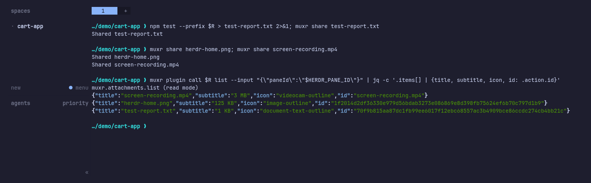

<h1 align="center">herdr-attachments</h1>

<p align="center">
  <a href="https://github.com/umeranjum17/herdr-attachments/actions/workflows/ci.yml"></a>
  <a href="LICENSE"></a>
  
  
</p>

<p align="center">
  <strong>The files your agent wrote, one tap away in the session.</strong><br/>
  An Attachments pill on your muxr session that opens a sheet of the pane's dump directory: screenshots, recordings, APKs, logs and documents, newest first, with MIME-aware icons and sizes. It lists metadata only and is one small read-only plugin.
</p>

<h3 align="center"><a href="#install"><ins>Install it</ins></a></h3>

<p align="center">
  
</p>

## Download

No packaged release yet — install straight from the plugin registry:

```sh
muxr plugin install umeranjum17/herdr-attachments
```

Full steps: [Install](#install). Watch the [releases page](https://github.com/umeranjum17/herdr-attachments/releases) for the first versioned release (current source version: `0.1.0`).

## Why it exists

Agents produce more than text: a screenshot of the broken page, a recording of the flow, a debug APK, the test log. When you are away from the desk, those files are stuck on the computer that made them.

Agents hand artifacts to a muxr session by writing them into the pane's attachment directory (`~/.muxr/attachments/pane/<pane-id>`), for example with `muxr share <file>` from inside the pane. This plugin is the viewer for that directory. It lists what is there and passes a file to muxr's own attachment pipeline only when you tap it.

## See it in action

### From the pane to the pill

The capture above was taken in an isolated Herdr session. A shell in the pane runs the plugin's own tests into `test-report.txt`, then shares that report, a screenshot and a screen recording with `muxr share`. `muxr share` writes each one into the pane's attachment directory. The last command asks the plugin for the same `list` call the Attachments pill makes, and gets back the real rows: title, size, icon and content id.

### Newest first, capped honestly

One `host.rpc` read lists the pane's directory by modification time, newest first. It returns at most 50 rows plus the true `total`, so a long session never floods the sheet or pretends the list is complete. Hidden files, directories and other non-files are skipped; a symlink to a file is followed and listed. Per muxr's plugin contract, an empty directory returns no rows and hides the pill; it appears on the next refresh after a file lands.

### Icons and types from the file name

The extension picks the icon and MIME type: images (`png`, `jpg`, `jpeg`, `gif`, `webp`), videos (`mp4`, `mov`, `webm`), Android packages (`apk`), and text (`json`, `txt`, `md`) each get their own icon. `pdf` is typed `application/pdf` but keeps the generic attachment icon, and anything else gets that icon with `application/octet-stream`. Sizes read as whole KB or MB, with a floor of 1 KB.

### Small files hashed, large files left alone

Files up to 2 MiB are hashed with SHA-256 when the list is built, so muxr can stream them through its relay-backed read path. Larger files, like the 3 MB recording above, are identified by name and resolved locally. They are never re-hashed each time the sheet opens.

**Also true:**

- **Offline is muxr's job.** The plugin keeps no cache; when the host is unreachable, muxr labels its cached UI as stale and disables host actions.
- **Hostile pane ids get nothing.** An empty or `.` pane id, or one containing `..`, `/` or `\`, returns an empty list, matching `muxr share`.
- **`MUXR_HOME` is respected.** When it is set, the listing reads `$MUXR_HOME/attachments/pane/<pane-id>` instead of `~/.muxr`.

## What it will not do

- **No bytes in the listing.** The RPC returns names, sizes, timestamps, icons and content ids, never file contents. Bytes move only through the kernel attachment action, which stays muxr-owned: transfer, authorization and encryption are not this plugin's job.
- **No writes.** One read RPC; no actions, no startup hooks, no panes, no secrets, no config.
- **No other attachment sources.** It lists exactly one directory: the current pane's dump directory. Camera uploads and other native attachment flows are muxr product code.

## Install

You need [Herdr](https://herdr.dev) 0.8.0 or newer, `node` 20 or newer on `PATH`, and a muxr app at UI version 2 or newer (the manifest's `minMuxrVersion`); an older app lists the plugin as unavailable. Per-row icons need UI version 8 or newer; older apps ignore them. Linux and macOS.

```sh
muxr plugin install umeranjum17/herdr-attachments
muxr plugin list        # muxr.attachments should appear, enabled
```

Then, from inside any Herdr pane, hand a file to the session:

```sh
muxr share screenshot.png
```

The Attachments pill appears on that session. Tap it to open the sheet, and tap a row to download that file through muxr.

Toggle without uninstalling:

```sh
herdr plugin disable muxr.attachments
herdr plugin enable muxr.attachments
```

## Uninstall

```sh
muxr plugin remove muxr.attachments    # or: herdr plugin uninstall muxr.attachments
```

The plugin itself writes nothing and keeps no state. Files you shared stay in `~/.muxr/attachments/pane/` until you delete them.

## Development

```sh
git clone https://github.com/umeranjum17/herdr-attachments
cd herdr-attachments
npm test                          # node built-in runner, zero dependencies; also runs in CI on every PR
muxr plugin check .               # validates the plugin and its muxr UI manifest
muxr plugin call . list --input '{"paneId":"<pane-id>"}'   # the exact read the pill makes
```

The tests drive the real `rpc.mjs` against a real dump directory in a temporary `MUXR_HOME`, including ordering, caps, small-versus-large hashing and hostile pane ids, rather than mocking its own output.

## License

MIT — see [LICENSE](LICENSE).
